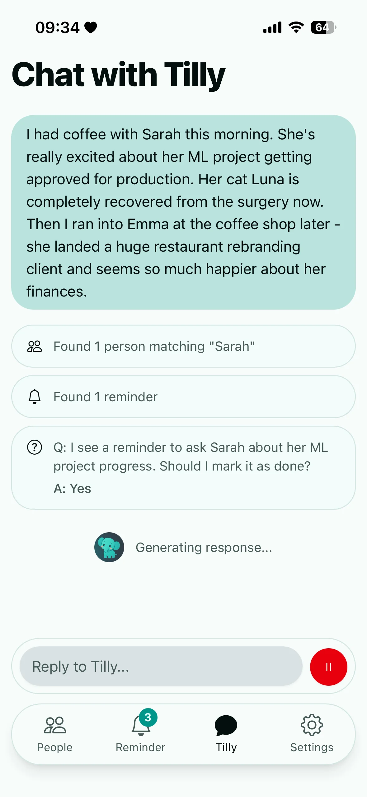
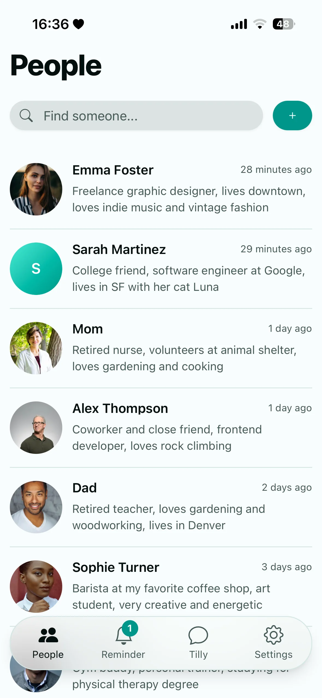

# Tilly

Tilly is an open-source personal relationship manager that helps you stay connected with the people who matter most. Built as a React PWA with client-side sync, offline-first design, and optional agentic AI assistance.

**Try it live:** [tilly.social](https://tilly.social)

<div align="center">
  <table>
    <tr>
      <td width="50%">
        
        <p><em>Tilly Chat: Turn conversations into organized memories and reminders</em></p>
      </td>
      <td width="50%">
        
        <p><em>Your people, organized and accessible</em></p>
      </td>
    </tr>
  </table>
</div>

## What Problem Does This Solve?

Your friend mentions their job interview. You care deeply. But weeks pass, and you realize you never asked how it went. Tilly gives relationships their own space - not buried in contacts, todos, or notes - so you remember what matters and reach out at the right time.

There are other apps already. Tilly is my take on simplicity and joy of use. And the AI assistant makes it easy to keep going.

## Quick Start

```bash
git clone https://github.com/ccssmnn/tilly.git
cd tilly
pnpm install
cp .env.example .env # (see setup section)
pnpm dev
```

## Setup

Copy `.env.example` to `.env` and add:

- **Clerk keys** - Authentication (create free account at clerk.com)
- **Jazz sync server** - Client-side encrypted sync storage (get key from jazz.tools)
- **Google Gemini API key** - For Tilly Chat assistant
- **VAPID keys** - Push notifications (generate with `npx web-push generate-vapid-keys`)
- **Cron secret** - Random string for scheduled jobs

## Architecture

Tilly is a **React PWA** built with:

- **App**: React + TanStack Router + Shadcn/ui + Tailwind CSS
- **API Endpoints**: Astro serving marketing pages + Hono API routes
- **Database**: [Jazz](https://jazz.tools) - Client-side encrypted, distributed, offline-first (keys managed via Clerk for multi-device use)
- **Auth**: Clerk
- **AI**: AI SDK with Google
- **Deployment**: Vercel

**Key Design**: Single Astro dev server hosts marketing site, PWA, and API routes together.

## Data & Privacy

**Encryption**: Data is encrypted in the browser before syncing to Jazz. Encryption keys are generated at signup and stored with Clerk so you can sign in from new devices. The Tilly server uses those keys only to deliver push notifications and power Tilly Assistant. Jazz never sees plaintext data and Clerk only stores the keys alongside your account metadata.

**Offline-First**: All data syncs through Jazz and works offline. AI assistant is the only feature requiring an active internet connection and shares the conversation you send with the AI provider.

**Data Control**: Full JSON export/import. No vendor lock-in. Move from or to your own hosted version anytime.

## Development

```bash
pnpm dev          # Start dev server
pnpm build        # Build for production
pnpm check        # TypeScript compilation check
```

## Self-Hosting

Deploy to Vercel with your own:

- Clerk account (authentication)
- Jazz sync server (database)
- Google Gemini API key (assistant)
- VAPID keys (push notifications)

## Contributing

⚠️ I still have to decide how I want to handle contributions regarding copyright and ownership. Please don't hesitate filing Bug Reports or Feature Requests.

## Security

Report suspected vulnerabilities privately by emailing [assmann@hey.com](mailto:assmann@hey.com) or DM to @ccssmnn on X; please avoid filing public issues until I respond.

## License

AGPL-3.0 - Personal use permitted. Any modifications (including server-side) must remain open source.

## Status

Actively maintained and used daily by the creator. Available as a hosted service at [tilly.social](https://tilly.social) (7 day free tier + $6/month for AI features) to make development sustainable and cover token costs.
